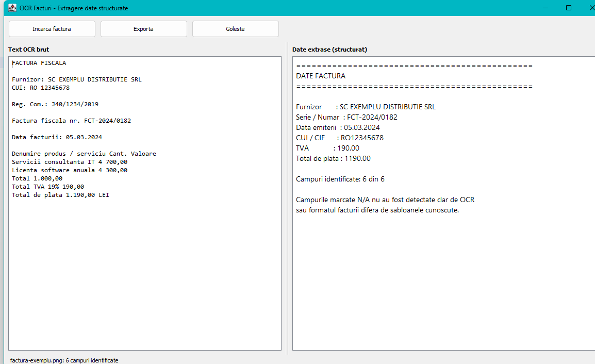

# Invoice OCR

Desktop application that reads an invoice image, runs OCR over it, extracts the
twelve fields and the goods table an accountant would otherwise retype, and
exports them as PDF, TXT, Markdown, HTML, JSON, XML or CSV.

It reads the page more than once, differently, and reconciles the readings
against one another and against the arithmetic every invoice obeys, so a figure
it reports has usually been confirmed by something other than the pattern that
found it.

Java 17 rewrite of a single-file C++/CLI program. Same behaviour, but every
responsibility is a separate, substitutable piece.



| | |
|---|---|
| **Version** | 1.2.0 |
| **Language** | Java 17 (built and tested on JDK 21) |
| **UI** | Swing, Romanian and English |
| **Runtime dependencies** | one: Tess4J (which bundles the native OCR engine) |
| **Fields** | 12 header fields, plus the rows of the goods table |
| **Size** | 134 main classes / ~8,600 lines, 44 test files / ~5,700 lines |
| **Tests** | 397, all green, no native library and no image files required |
| **Recognition** | 140 / 140 fields across an 18-layout corpus, plus every table row |
| **Docs** | 13-page user wiki |
| **Licence** | Proprietary — all rights reserved, [see below](#licence) |

> **Using the application rather than working on it?**
> Start at the user guide: [user-docu/Home.md](user-docu/Home.md), or open
> [user-docu/html/index.html](user-docu/html/index.html) for the browsable wiki.
> This README is the developer's view.

> [!IMPORTANT]
> **This code is not licensed for use.** Invoice OCR is proprietary and all
> rights are reserved. You may read it; you may not build it, run it, copy it,
> adapt it or reuse any part of it in your own work without written permission.
> Developers are explicitly not permitted to use this code at this time — see
> [Licence](#licence) and [LICENSE](LICENSE).

---

## Contents

- [Quick start](#quick-start)
- [Requirements](#requirements)
- [Configuration](#configuration)
- [How it works](#how-it-works)
- [Architecture](#architecture)
- [Project layout](#project-layout)
- [The domain model](#the-domain-model)
- [Extraction](#extraction)
- [Export](#export)
- [Internationalisation](#internationalisation)
- [Error handling](#error-handling)
- [Concurrency](#concurrency)
- [Testing](#testing)
- [Extending it](#extending-it)
- [The installer](#the-installer)
- [API documentation](#api-documentation)
- [User documentation](#user-documentation)
- [Differences from the C++ original](#differences-from-the-c-original)
- [What has actually been verified](#what-has-actually-been-verified)
- [Known limitations](#known-limitations)
- [Changelog](#changelog)
- [Licence](#licence)

---

## Quick start

```bash
mvn clean package
java -jar target/invoice-ocr.jar
```

`mvn test` runs the suite. `target/invoice-ocr.jar` is a shaded, self-contained
jar — the only thing it needs from outside is a `tessdata` folder.

Without Maven on your PATH, the whole project compiles with plain `javac`
against the Tess4J jar; see [Testing](#testing) for the exact commands.

### Getting language data

The OCR engine itself ships inside the jar. Its **language data** does not, and
that is the one thing you must supply:

```bash
winget install UB-Mannheim.TesseractOCR      # installs C:\Program Files\Tesseract-OCR\tessdata
```

Or download individual `*.traineddata` files from
[tessdata_fast](https://github.com/tesseract-ocr/tessdata_fast) into any folder
and point `ocr.tessdata.path` at it. `eng` is enough to start; add `ron` for
Romanian invoices.

---

## Requirements

| | |
|---|---|
| JDK | 17 or newer (the app also checks this at install time) |
| Maven | 3.8+ (optional — a local `javac` path is documented below) |
| OS | Any that runs Java + Swing. The installer is Windows-only |
| Language data | A `tessdata` folder with at least `eng.traineddata` |

Dependencies, both declared in [pom.xml](pom.xml):

| Artifact | Version | Scope | Why |
|---|---|---|---|
| `net.sourceforge.tess4j:tess4j` | 5.11.0 | compile | JNA binding over libtesseract; ships the native libraries |
| `org.junit.jupiter:junit-jupiter` | 5.10.2 | test | Tests |

Nothing else. PDF export is hand-written rather than pulling in a PDF toolkit —
see [Export](#export).

---

## Configuration

Fourteen settings, all optional except the tessdata path.

| Setting | Default | Meaning |
|---|---|---|
| `ocr.tessdata.path` | `C:/Program Files/Tesseract-OCR/tessdata` | Folder holding `*.traineddata`. **The one you must get right** |
| `ocr.language` | `eng` | Language(s) to recognise; combine with `+`, e.g. `ron+eng` |
| `ocr.pageSegmentationMode` | `3` | Tesseract PSM for the first pass. `3` automatic, `4` single column, `6` single block, `11` sparse |
| `ocr.engineMode` | `3` | Tesseract OEM. `3` default, `1` LSTM only |
| `ocr.passes.maximum` | `4` | How many differently-prepared readings a page may get. `1` restores 1.1 |
| `ocr.passes.targetConfidence` | `0.80` | Mean confidence at which a reading is accepted without trying another |
| `document.supportedExtensions` | `png,jpg,jpeg,bmp,tif,tiff,gif` | Formats offered in the open dialog and accepted by the loader |
| `image.preprocessing.enabled` | `true` | Whether images are prepared before OCR. `false` collapses the ladder to one untouched pass |
| `image.preprocessing.minimumWidth` | `1000` | Images narrower than this are upscaled (max 4×); `0` disables |
| `extraction.lineItems.enabled` | `true` | Whether the goods table is read as well as the header fields |
| `report.showConfidence` | `true` | Whether inferred values are marked for the reader |
| `report.lineItems` | `true` | Whether reports carry the table rows |
| `ui.locale` | `ro` | Interface language: `ro` or `en` |
| `export.defaultFormat` | `pdf` | Format the save dialog opens on |

The two that matter for speed are `ocr.passes.maximum` and
`ocr.passes.targetConfidence`. Raising the target buys accuracy on awkward scans
by running more passes; lowering it, or setting the maximum to `1`, buys back the
1.1 timings exactly.

### Precedence

Each source overrides the ones below it, so a deployment override never needs a
rebuild:

| # | Source | Example |
|---|---|---|
| 1 | JVM system property | `java -Docr.tessdata.path=D:/tessdata -jar invoice-ocr.jar` |
| 2 | Environment variable | `set OCR_TESSDATA_PATH=D:/tessdata` |
| 3 | `invoice-ocr.properties` next to the jar | `ocr.language=ron+eng` |
| 4 | Bundled [application.properties](src/main/resources/application.properties) | the defaults above |

Environment names are the dotted key uppercased with underscores:
`ocr.tessdata.path` → `OCR_TESSDATA_PATH`.

**Use forward slashes in paths.** A `.properties` file reads `\` as an escape
character, so `C:\Program Files\...` is silently mangled. The installers write
forward slashes for exactly this reason.

### How configuration is modelled

```
ConfigurationSource  (Optional<String> find(String key))
  ├── SystemPropertiesConfigurationSource
  ├── EnvironmentConfigurationSource      (dotted key → SCREAMING_SNAKE_CASE)
  ├── PropertiesConfigurationSource       (file or classpath)
  └── ChainedConfigurationSource          (first non-blank wins)
                 │
                 ├──▶ OcrSettings     (typed, validated: paths, ints, lists, passes)
                 ├──▶ ExportSettings  (typed: default export format)
                 └──▶ ReportSettings  (typed: what a report shows about itself)
```

Consumers depend on the small typed interfaces, never on raw strings, so nothing
downstream parses or validates. A blank value counts as absent, so an empty
override cannot mask a real setting.

---

## How it works

The document is decoded once, then read as many times as it takes. Each reading
is a *pass*: one preparation of the image, one assumption about the layout. The
results are merged field by field, and the merged fields are then reconciled
against the arithmetic.

```
   file on disk
        │
        ▼  DocumentLoader          ImageIoDocumentLoader, extension-checked
   SourceImage (BufferedImage + origin)          ── decoded once ──┐
        │                                                          │
        ├── pass 1 "plain"        Upscale → Grayscale              │
        ├── pass 2 "straightened" Deskew → Upscale → Contrast      │  stops as
        ├── pass 3 "binarised"    … → AdaptiveThreshold,  PSM 4    │  soon as a
        └── pass 4 "sharpened"    … → Sharpen,            PSM 6    │  reading is
                 │                                                 │  good enough
                 ▼  OcrEngine     TesseractOcrEngine, one per pass │
          RecognizedText  ────▶  InvoiceParser  ────▶  InvoiceData ┘
                                       │
                                       ▼  InvoiceRefinement
                                  line items → dates → arithmetic
                                       │
                 ┌─────────────────────┘
                 ▼  InvoiceDataMerger   best value per field, agreement rewarded
            InvoiceData  ───▶ InvoiceReportFormatter ───▶ the right-hand panel
                         └──▶ InvoiceExportService   ───▶ a file
```

`MultiPassInvoiceRecognitionService` owns nothing but the order of these calls;
it holds no format, engine or regex knowledge. The engine is created per pass and
closed in a try-with-resources, so a failure mid-recognition still releases the
native handle — there is a test for that.

The ladder is paid for only when it is needed. A clean scan satisfies the first
pass and stops there, at the 0.4–0.5 s a 1240×900 page took in 1.1; a page that
leaves fields unread or unsure costs one further OCR call per pass, and no
further decoding.

---

## Architecture

Dependencies point inwards. The UI knows the service; the service knows
interfaces; nothing knows about Tesseract except one package.

```
ui.swing ──▶ presentation ──▶ service ──▶ recognition ──▶ ocr ──▶ ocr.tesseract
                  │              │        image
                  ├──▶ export    │        extraction ──▶ extraction.rules
                  ▼              ▼                   ├──▶ extraction.validation
               format         domain                 ├──▶ extraction.items
                                                     └──▶ extraction.normalization
```

| Package | Classes | Responsibility |
|---|--:|---|
| `domain` | 9 | Value types. No behaviour beyond validation |
| `config` | 14 | Untyped sources, typed views over them |
| `i18n` | 3 | `MessageSource`; no user-visible string is hard-coded |
| `image` | 10 | File → image, image → image |
| `ocr` | 3 | `OcrEngine`, `OcrEngineFactory`, `OcrOptions` — the native seam |
| `ocr.tesseract` | 3 | The only package that imports Tess4J |
| `recognition` | 4 | Passes over one page, and the merge of what they read |
| `extraction` | 16 | *Where* a value is: the strategies, rules and parser |
| `extraction.text` | 7 | The page prepared for searching: folding, regions, value shapes, digit repair |
| `extraction.validation` | 7 | *Whether it can be true*: checksums, the calendar, the arithmetic |
| `extraction.items` | 3 | The goods table: its rows, and what they prove |
| `extraction.normalization` | 14 | *How it should look* once found |
| `extraction.rules` | 1 | Which strategy ladder applies to which document dialect |
| `format` | 9 | Rendering `InvoiceData` as text in seven shapes |
| `export` | 7 | Which format goes to which file, written safely |
| `service` | 2 | The use case |
| `concurrent` | 3 | `TaskExecutor`, keeping OCR off the event thread |
| `ui` | 6 | Toolkit-free contracts |
| `ui.swing` | 5 | The Swing implementations |
| `presentation` | 1 | `InvoicePresenter`: intents in, view updates out |
| `exception` | 6 | One typed hierarchy for every failure |
| `app` | 2 | Composition root and `main` |

### Why the seams are where they are

- **`OcrEngine` as an interface.** Tesseract needs a native library and a
  tessdata directory. Behind an interface the whole pipeline is testable with a
  fake engine, and a cloud OCR backend is a one-line change in the assembler.
- **Matching split from normalising split from checking.** A regex decides
  *where* a value is; a `ValueNormalizer` decides *how it should look*; a
  `ValueCheck` decides *whether it can be true*. `1.234,56`, `1,234.56` and
  `1 234,56` all become `1234.56` without touching a single pattern, and a
  fiscal code whose control digit does not add up loses to one that does without
  either of them knowing the other exists.
- **A pass is a value.** `RecognitionPass` is a preparation of the image plus an
  assumption about the layout — the two guesses that used to be made once, in
  configuration, and could not be revisited. Made explicit, they can be made
  several times and the answers compared.
- **Refinements after rules.** Each rule is blind to the others, which is what
  keeps it simple and is also its ceiling: no rule can notice that the VAT and
  the total do not add up. An `InvoiceRefinement` sees the whole invoice once
  the rules are done, and is where every derived value comes from.
- **Rules as data.** A field is a `FieldDefinition` plus an `ExtractionRule`, not
  a branch in a method. Adding one changes no existing class.
- **`format` separate from `export`.** Rendering produces a string; exporting
  writes bytes to a file. `TextInvoiceExporter` adapts any formatter into an
  exporter, so each new text format costs one small formatter and nothing else.
- **`TaskExecutor`.** The original blocked the UI thread for the whole OCR run.
  Here the presenter hands work to an executor: Swing gets `SwingTaskExecutor`,
  tests get `DirectTaskExecutor` and stay synchronous.
- **Toolkit-free UI contracts.** `InvoiceView`, `DocumentChooser`,
  `ExportChooser` and `UserNotifier` mention no Swing type, so
  `InvoicePresenter` is unit-tested against fakes with no window on screen.
- **Composition root.** [`ApplicationAssembler`](src/main/java/com/invoiceocr/app/ApplicationAssembler.java)
  is the only class that names concrete implementations. Every other class takes
  its collaborators through the constructor. Each wiring step is a `protected`
  method, so a variant assembler overrides one method rather than rewriting the
  graph.

---

## Project layout

```
alin/
├── pom.xml                     Maven build, shade plugin, Java 17 target
├── README.md                   this file
├── src/main/java/com/invoiceocr/
│   ├── app/                    ApplicationAssembler, InvoiceOcrApplication
│   ├── concurrent/             TaskExecutor, Swing + Direct implementations
│   ├── config/                 ConfigurationSource ×4, OcrSettings, ExportSettings,
│   │                           ReportSettings, SettingKeys
│   ├── domain/                 FieldDefinition, InvoiceFields, ExtractedField, LineItem,
│   │                           FieldConfidence, InvoiceData, RecognizedText, SourceImage
│   ├── exception/              InvoiceOcrException + 5 subtypes
│   ├── export/                 ExportFormat(s), InvoiceExporter, TextInvoiceExporter,
│   │                           PdfInvoiceExporter, DefaultInvoiceExportService
│   ├── extraction/             FieldExtractor, Extraction, the strategies, ExtractionRule
│   │   │                       (+Builder), ExtractionRuleProvider, InvoiceRefinement, parser
│   │   ├── items/              LineItemExtractor, TableLineItemExtractor, LineItemRefinement
│   │   ├── normalization/      ValueNormalizer + 10 implementations + Normalizers
│   │   ├── rules/              RomanianInvoiceRuleProvider
│   │   ├── text/               SearchText, TextFolding, TextRegion, ValuePattern(s), OcrDigits
│   │   └── validation/         ValueCheck, Verdict, FiscalCodes, Ibans, Dates,
│   │                           InvoiceArithmetic, ArithmeticRefinement, DateRefinement
│   ├── format/                 PlainText, Markdown, Html, Json, Xml, Csv, RawTextAppending
│   ├── i18n/                   MessageSource, ResourceBundleMessageSource, MessageKeys
│   ├── image/                  DocumentLoader, ImagePreprocessor, Grayscale, Upscale, Composite,
│   │                           Deskew, AdaptiveThreshold, ContrastStretch, Sharpen
│   ├── ocr/                    OcrEngine, OcrEngineFactory, OcrOptions
│   │   └── tesseract/          TesseractOcrEngine, factory, TesseractInstallation
│   ├── presentation/           InvoicePresenter
│   ├── recognition/            RecognitionPass, RecognitionPlan, PassOutcome, InvoiceDataMerger
│   ├── service/                InvoiceRecognitionService, MultiPassInvoiceRecognitionService
│   └── ui/                     InvoiceView, listeners, choosers, UserNotifier
│       └── swing/              SwingInvoiceView, chooser ×2, notifier, TitledTextPanel
├── src/main/resources/         application.properties, messages.properties, messages_ro.properties
├── src/test/java/…             37 test classes + 7 fakes in support/
├── installer/                  NSIS script, PowerShell installer, build script, icon
└── user-docu/                  13-page Markdown wiki, images, build-html.java, html/
```

---

## The domain model

Nine small types, all immutable:

| Type | Shape |
|---|---|
| `FieldDefinition` | `record(key, labelKey, displayOrder)` — a value, not an enum, so a new field can come from an extension |
| `InvoiceFields` | Catalog of the twelve built-in definitions plus `ALL` and `MONEY` |
| `FieldConfidence` | The named bands a value can be rated at, and what they mean |
| `RecognizedText` | `record(value)` — raw OCR output, null-safe |
| `SourceImage` | `record(origin, image)` — pixels with the file they came from |
| `ExtractedField` | `record(definition, Optional<String> value, confidence, strategy)` |
| `LineItem` | `record(description, Optional quantity, Optional unitPrice, lineTotal)` |
| `InvoiceData` | Ordered map of fields keyed by `key`, plus the source text and the table |

Four decisions worth knowing:

- **Missing fields are kept, not dropped.** `InvoiceData` always holds all
  twelve, so a renderer decides how absence looks (`N/A`, `null`, an empty cell)
  without knowing the catalog.
- **Fields are display-ordered.** `InvoiceData.of(...)` sorts by
  `displayOrder`, so every formatter emits the same order without sorting.
- **A value carries how it was found.** Not decoration: it is what lets two
  readings of the same page be compared, and what tells the user which two
  figures to check rather than all twelve.
- **Display orders are spaced, not consecutive.** The six fields of 1.1 became
  twelve without renumbering one of them.

---

## Extraction

Recognition is a **ladder of strategies per field**, not one regular
expression. The ladder is written most specific first, and that order decides —
with one exception, which is the substance of 1.2: a candidate the rule can
*verify* outranks the unverified ones before it.

| Rung | Strategy | Handles |
|---|---|---|
| 1 | Label with the value beside it | `Furnizor: SC ALFA SRL` |
| 2 | Label with the value on one of the next lines, in its own column | column headings, block layouts |
| 3 | Value recognised by its shape, inside the right part of the page | the supplier's `RO…` code |
| 4 | Value recognised anywhere, or inferred | letterhead names, "the largest amount is the total" |

Each rung is then put to the rule's `ValueCheck`, which returns one of four
verdicts:

| Verdict | Meaning | What the parser does |
|---|---|---|
| `PROVEN` | a control digit that adds up, a real calendar date | take it, rated `VERIFIED` |
| `UNPROVEN` | nothing to check it against | keep it at what the strategy earned |
| `DOUBTFUL` | checked and wrong, but the right kind of value | last resort, halved and flagged |
| `IMPOSSIBLE` | not a value of this kind at all | discard; the next rung gets its turn |

### What is recognised

| Field | Key | Strategies, in priority order |
|---|---|---|
| Furnizor | `supplier` | Furnizor, Emitent, Vânzător, Prestator — then any company-shaped line in the supplier's block |
| Cumparator | `buyer` | Cumparator, Client, Beneficiar, Achizitor — never the letterhead, so a page with no buyer reports none |
| Serie / Numar | `invoiceNumber` | Seria AB nr 1024; Factura (fiscala) nr./numar/no.; Nr. factura (including as a column heading); Seria; Invoice no. |
| Data emiterii | `issueDate` | Data facturii/emiterii; `din <date>`; Data; then the first plausible date — **checked against the calendar** |
| Data scadentei | `dueDate` | Termen de plata, Scadenta — or the issue date plus a term printed in days |
| CUI / CIF | `fiscalCode` | CUI, CIF, Cod fiscal, Cod de identificare fiscala, scoped to the supplier's block first — **checked against its control digit** |
| Reg. Comertului | `registrationNumber` | Reg. Com., Registrul Comertului, ORC — or the `J40/1122/2015` shape anywhere in the supplier's block |
| IBAN | `iban` | IBAN, Cont, Cont bancar — **vetoed by mod-97**, so an account that does not verify is never reported |
| Total fara TVA | `netAmount` | Total fara TVA, Baza impozabila, Subtotal — or derived, or the sum of the table rows |
| TVA | `vatAmount` | Total TVA, Valoare TVA, TVA — never `fara TVA` — or derived |
| Total de plata | `totalAmount` | Total de plata/general/factura; Total (not `Total fara`); then the largest amount — or derived |
| Moneda | `currency` | RON, LEI, EUR, USD, GBP, CHF, MDL beside the totals; `LEI` is reported as `RON` |

Plus every row of the goods table: description, quantity, unit price and value.

### Reading the page more than once

The largest single cause of a missing field was never the rules. It was the
transcription: a pattern cannot read text the OCR pass never produced. A single
pass has to commit, before it has seen anything, to one preparation of the image
and one assumption about the layout, and when either guess is wrong the fields it
loses are lost for good.

So the page is read again, differently. Four passes are available, and they are
ordered so that the cheap one comes first:

| Pass | Prepares the image by | Assumes |
|---|---|---|
| `plain` | upscaling, then greyscale — the 1.1 pipeline | whatever is configured |
| `straightened` | deskewing, upscaling, stretching the contrast | whatever is configured |
| `binarised` | the above, then an adaptive threshold | a single column (PSM 4) |
| `sharpened` | deskewing, upscaling, sharpening, greyscale | one block of text (PSM 6) |

`MultiPassInvoiceRecognitionService` stops as soon as a reading is good enough —
mean confidence over the target, and nothing flagged for review — so a clean scan
still costs exactly one pass. The image is decoded once and each pass prepares
its own copy, so a further reading is an OCR call and nothing more.

`InvoiceDataMerger` then picks a winner per field on two grounds: how the value
was found, and **how many passes agree on it**. Agreement is strong evidence,
because the mistakes OCR makes belong to the rendering rather than to the page —
a threshold that turns `8` into `B` does not survive being deskewed and sharpened
instead. A modest reading from two passes therefore beats a confident one from a
single pass.

The image passes themselves are ordinary `ImagePreprocessor`s and are tested on
pages generated in the test, at a known skew and a known lighting gradient:

- **`DeskewPreprocessor`** finds the angle by projection profiling — counting ink
  into rows for a range of candidate angles and keeping the one whose row counts
  are most uneven, because text that lines up leaves the gaps between lines
  empty. Profiling runs on a downscaled copy, so it is cheap enough to leave on.
- **`AdaptiveThresholdPreprocessor`** judges each pixel against the mean of the
  window around it, computed from an integral image. A shadow moves a pixel and
  its neighbours together, so comparing them removes the lighting entirely.
- **`ContrastStretchPreprocessor`** rescales the band a faded page actually
  occupies onto the full range, measuring the band by percentile so one speck of
  dust cannot define it.
- **`SharpenPreprocessor`** puts an edge back on characters that upscaling or a
  lens softened.

### Checking what was read

Three facts about invoice values that no amount of pattern-matching can supply:

- **The fiscal code has a control digit.** `FiscalCodes` computes it against the
  fixed key `753217532`. Of two codes printed in identical shape, the one that
  adds up is the one that was read correctly — which is independent of layout,
  and so succeeds where region scoping alone fails.
- **The IBAN has a mod-97 checksum.** `Ibans` applies it as a *veto*: the pattern
  that finds an account is deliberately loose, so the checksum is not confirming
  the match, it **is** the match.
- **`net + VAT = total`.** `ArithmeticRefinement` uses it four ways: to confirm
  three figures that agree, to derive a missing one from two that are known, to
  correct one that contradicts the other two, and to split a gross figure when
  the rate is printed beside it. Nothing is invented — every value it writes is
  implied by two values that were actually printed.

Plus the calendar. `Dates` parses strictly, so `31.02.2024` is refused rather
than quietly rounded to the 29th, and the rule falls through to the next rung.

### Reading a damaged page

Four mechanisms, each separately tested:

- **Diacritic folding.** `SearchText` keeps the original alongside a folded copy
  of *identical length*, so patterns are written in plain ASCII, match `Vânzător`
  and `fără`, and every offset still points at the same place — the value handed
  back keeps its accents.
- **OCR digit tolerance.** Every digit position accepts `O I l S B Z`, because a
  pattern insisting on `[0-9]` rejects `l.428,OO` outright. `OcrDigits` puts the
  digits back afterwards: wholly for amounts and dates, and only for entirely
  digit-shaped runs in an invoice number, so `ZT-OO91` becomes `ZT-0091` while
  `AB123` and a series like `SB` are left alone. Every pattern also demands at
  least one real digit, so a word can never pass as a number.
- **Region scoping.** An invoice names two companies whose codes look identical;
  only position tells them apart. `DocumentRegions` locates the supplier's block
  — correctly even when the buyer is printed first — and `RegionScopedExtractor`
  confines the search to it.
- **Negative context.** `Total fara TVA` is the *net* line. Bounded look-behind
  (`(?<!fara )TVA`) and look-ahead (`Total(?![ \t]*fara)`) keep that line's
  amount out of the VAT and total fields.

### Two traps worth knowing

**Labels must not span lines.** Label patterns use `[ \t]*`, never `\s*`: `\s`
matches a newline, so the label itself slides onto the next line and the search
window starts a line too far down. Reaching the next line is the *window's* job.
That single mistake caused two of the last three corpus failures.

**Guessing is gated.** The "largest amount is the total" rung only fires when the
page mentions a total, a sum or an invoice at all (`ContextGatedExtractor`), so a
blank scan or OCR noise yields `N/A` rather than a confident wrong number.

### Accuracy

`RecognitionAccuracyTest` scores the rules against
[`InvoiceCorpus`](src/test/java/com/invoiceocr/support/InvoiceCorpus.java):
eighteen transcribed layouts covering block suppliers, column headings,
right-aligned totals, a buyer-first page, OCR noise, all-caps, diacritics, a bare
letterhead, an itemised table, a payment term, a foreign currency, an impossible
date, a misread total and a gross-only receipt.

| | Fields measured | Read correctly | Reported `N/A` | Wrong value |
|---|--:|--:|--:|--:|
| 1.1.0, before the strategy ladder | 60 | 38 (63%) | 10 | 12 |
| 1.1.1, after it | 60 | 60 (100%) | 0 | 0 |
| 1.2.0, twelve fields over eighteen layouts | 140 | **140 (100%)** | **0** | **0** |

Four further assertions run over the same corpus, because a per-field score can
be satisfied by luck:

- every table row on every layout is read, in order;
- the three amounts on every layout satisfy `net + VAT = total`;
- fewer than one value in five is a guess rather than a reading;
- a page that is not an invoice still yields nothing at all.

The corpus is a permanent regression guard: a rule tuned for one layout that
breaks another fails the build.

Two cautions about that 140. The corpus is transcribed OCR output, not
photographs, so it measures the rules, the checks and the arithmetic — not the
recognition engine and not the image passes, which are tested separately on
generated pages. And the fiscal codes in it are checksum-valid by construction,
which is the point: a corpus of invented codes would exercise the fallback path
on every sample and never the one that matters.


### Priority beats position

Invoices routinely print a subtotal labelled `Total` above the real
`Total de plata`. A single alternation would take whichever label appears first
on the page; `FirstMatchFieldExtractor` tries patterns in order and keeps the
first hit, so the specific label wins wherever it sits. There is a test that
asserts both behaviours side by side.

### Normalisation

| Chain | Steps | Example |
|---|---|---|
| `Normalizers.text()` | collapse whitespace → trim edge punctuation | `SC   EXEMPLU  SRL \|` → `SC EXEMPLU SRL` |
| `Normalizers.code()` | text → uppercase | ` fct-2024/0182 ` → `FCT-2024/0182` |
| `Normalizers.amount()` | text → positional decimal rule | `1.190,00` `1,190.00` `1 190,00` → `1190.00` |
| `Normalizers.date()` | text → day-first, 2-digit year → 20xx | `5.3.24` → `05.03.2024` |
| `Normalizers.fiscalCode()` | text → strip separators, uppercase | `ro 12.345.678` → `RO12345678` |
| `Normalizers.iban()` | text → compact, uppercase, regroup in fours | `ro49aaaa1b3100759384 0000` → `RO49 AAAA 1B31 0075 9384 0000` |
| `Normalizers.currency()` | text → ISO 4217 | `lei` → `RON` |
| `Normalizers.registrationNumber()` | text → strip spacing, uppercase | `J 12 / 345 / 2018` → `J12/345/2018` |

The amount rule is positional rather than locale-based: the last separator is a
decimal point **only** when exactly two digits follow it; every other separator
is a thousands separator and disappears.

A date that is not plausible — `32.01.2024`, or an ISO-style `2024-03-05` — is
returned **unchanged** rather than reformatted into something wrong. That is a
deliberate signal to check the raw panel.

---

## Export

Seven formats, registered in `ApplicationAssembler.exportService(...)`:

| Format | Extension | Contains | Implementation |
|---|---|---|---|
| PDF | `.pdf` | fields + table + raw text | `PdfInvoiceExporter` (hand-written) |
| Plain text | `.txt` | fields + table + raw text | `PlainText` wrapped in `RawTextAppendingFormatter` |
| Markdown | `.md` | fields + table + raw text | `MarkdownInvoiceReportFormatter` |
| HTML | `.html` | fields + table + raw text | `HtmlInvoiceReportFormatter` (self-contained, themed) |
| JSON | `.json` | fields + confidence + table + summary | `JsonInvoiceReportFormatter` |
| XML | `.xml` | fields + confidence + table | `XmlInvoiceReportFormatter` |
| CSV | `.csv` | fields only, one row per invoice | `CsvInvoiceReportFormatter` (RFC 4180, CRLF) |

**The split is a rule, not an accident.** Readable formats carry the raw OCR
text because a person may need to check what the engine saw; data formats carry
the fields alone, under fixed English keys, so a file means the same thing
whatever `ui.locale` says.

CSV is the exception to everything 1.2 added, deliberately. It stays one header
row and one value row so that several exported invoices still stack into a
spreadsheet by pasting them under each other — a shape that confidence columns
or a variable number of table rows would destroy. It gained the six new fields
as six new columns and nothing else.

### Writing safely

`DefaultInvoiceExportService` writes to `<target>.part` and moves it into place
only when the write completes. A failure halfway through therefore never
truncates a good existing file, and no partial file is left behind. Both are
tested.

### The PDF writer

`PdfInvoiceExporter` emits a conforming PDF 1.4 file by hand: catalog, page
tree, one content stream per page, and the three standard Type 1 fonts every
reader has built in. Roughly 250 lines, and it keeps the jar free of a
multi-megabyte PDF toolkit that would do far more than this report needs.

- Text is real text — searchable and selectable, not an image.
- Long OCR text paginates, and each page carries `Page n of m`.
- Encoding is WinAnsi, which those fonts declare. Romanian letters outside it
  are transliterated (`ă`→`a`, `ș`→`s`, `ț`→`t`) so a PDF is always produced;
  every other format keeps them intact. This is documented for users too.
- `(`, `)` and `\` are escaped, or they would end a PDF string early.

The unit test walks the cross-reference table and asserts every byte offset
points at the object it claims — a wrong offset yields a file that opens blank,
which is exactly the bug a cheap test can catch.

---

## Internationalisation

- `MessageSource` is a one-method interface; `ResourceBundleMessageSource`
  implements it over `ResourceBundle` with `MessageFormat` arguments.
- 60 keys, in two bundles: [`messages.properties`](src/main/resources/messages.properties)
  (English, the base) and [`messages_ro.properties`](src/main/resources/messages_ro.properties)
  (Romanian, the default via `ui.locale=ro`).
- A missing key degrades to the key itself. A translation gap must never take
  the application down.
- Lookup uses `ResourceBundle.Control.getNoFallbackControl`. **Without it**, a
  missing bundle is looked up under the *host's* locale before the base one, so
  asking for Romanian on an English machine can silently yield a third language.
  That bug was real here and is covered by a regression test.

---

## Error handling

```
InvoiceOcrException (unchecked)
├── ConfigurationException          missing tessdata, bad setting value
├── DocumentLoadException           unreadable or undecodable file
│   └── UnsupportedDocumentException  extension not in the allow-list
├── OcrExecutionException           engine failed or returned nothing
└── ExportException                 file could not be written
```

Everything is unchecked so failures travel freely through suppliers, callables
and listeners without every layer re-wrapping them. Each layer translates
foreign exceptions into one of these, and the presenter distinguishes them from
defects: an `InvoiceOcrException` shows its own message, anything else is
wrapped in a generic "unexpected error" so a raw stack-trace message never
reaches a dialog.

Diagnostics are specific on purpose. `TesseractInstallation.verify()` reports
the directory it looked in, the language it wanted, and the `*.traineddata`
files actually present — the difference between a five-second and a one-hour
fix.

---

## Concurrency

OCR takes seconds; doing it on the event dispatch thread freezes the window.
`TaskExecutor` has one method:

```java
<T> void execute(Callable<T> task, Consumer<T> onSuccess, Consumer<Throwable> onFailure);
```

`SwingTaskExecutor` runs the task on a `SwingWorker` and fires both callbacks on
the EDT. `DirectTaskExecutor` runs inline, which is what the presenter tests
use. The presenter itself never mentions a thread.

---

## Testing

397 tests across 37 test classes, plus fakes and the corpus in
`src/test/java/.../support/`. Everything except the Tess4J binding runs without a
native library — the engine is an interface — and **without a single image file**:
the pages the image passes are tested on are drawn in the test, at a skew and a
lighting gradient the assertions then know exactly.

| Area | Class | Notable coverage |
|---|---|---|
| Accuracy | `RecognitionAccuracyTest` | The 18-layout corpus, field by field and row by row; every layout balances; refuses to invent values on a non-invoice |
| Page preparation | `SearchTextTest` | Folding preserves length and offsets; values keep their accents; regions confine a search but stay transparent to look-behind |
| Value shapes | `ValuePatternsTest` | Amounts in every convention; dates and percentages rejected as amounts; IBANs, register numbers, currencies, VAT rates; totals and heading landmarks |
| Parts of the page | `DocumentRegionsTest` | Supplier, buyer, totals and items blocks, in both orderings and with either party absent |
| Strategies | `ExtractionStrategiesTest` | Value below a heading, line budget, column alignment, largest-amount selection, gating, supplier-vs-buyer scoping, digit repair |
| Ratings | `ExtractionConfidenceTest` | Each strategy's band, the ladder discount, the scope bonus and its cap, alternatives |
| Checks | `FiscalCodesTest`, `IbansTest`, `DatesTest` | Control digits, mod-97, the calendar; each verdict and what it costs |
| Arithmetic | `InvoiceArithmeticTest` | `net + VAT = total`, the rates in force, gross-to-net |
| Refinements | `RefinementsTest` | Confirm, derive, correct, split, dispute; payment terms; date ordering |
| Goods table | `TableLineItemExtractorTest`, `LineItemRefinementTest` | Column shapes, row-index columns, rules and summaries skipped; rows as evidence for the net amount |
| Image passes | `ImagePreprocessorsTest` | Skew measured to a tenth of a degree and corrected; uneven lighting survived; a flat page stretched; a good page left alone |
| Passes and merging | `RecognitionPlanTest`, `InvoiceDataMergerTest` | The ladder and its limits; the better strategy wins, agreement outranks confidence, silence is not a vote |
| Normalisation | `AmountNormalizerTest`, `DateNormalizerTest`, `NormalizersTest` | Every separator convention; implausible dates left alone |
| Extraction | `FirstMatchFieldExtractorTest` | Priority order vs. a naive alternation, side by side |
| | `RuleBasedInvoiceParserTest` | Missing fields kept, first winning rule, display order |
| | `RuleBasedInvoiceParserSelectionTest` | Order leads, proof overrules it, doubt is a last resort, impossible is never reported |
| | `RomanianInvoiceRuleProviderTest` | A full invoice, layout variants, the 1.2 fields, garbage input |
| Pipeline | `MultiPassInvoiceRecognitionServiceTest` | Stage order, preprocessed image reaches the engine, every engine closed; stops early on a clean page, carries on for a poor one, rescues a field, decodes once |
| Export | `DefaultInvoiceExportServiceTest` | Temp-file safety, no partial files, unknown format |
| | `PdfInvoiceExporterTest` | xref offsets, page tree, pagination, transliteration, escaping, the goods table |
| Formats | `StructuredFormattersTest`, `ReportEnrichmentTest` | XML parsed by a real `DocumentBuilder`; CSV quoting and stackability; HTML escaping; review marks and table rows in all six |
| Domain | `InvoiceDataTest` | Confidence clamping, review marks, averaging over what was found |
| Presentation | `InvoicePresenterTest` | Export gating, file-name suggestion, failure paths, clear, the review count in the status line |
| Config / i18n | `ChainedConfigurationSourceTest`, `ConfigurationBackedOcrSettingsTest`, `ConfigurationBackedReportSettingsTest`, `ResourceBundleMessageSourceTest`, `OcrOptionsTest` | Precedence, blank values, clamping, locale fallback |

```bash
mvn test
```

### Without Maven

The project compiles and tests with plain `javac` given the Tess4J jar and the
JUnit 5 jars on the classpath:

```bash
find src/main/java -name '*.java' > sources.txt
javac -encoding UTF-8 -Xlint:all -Werror -d out/main -cp tess4j.jar @sources.txt
find src/test/java -name '*.java' > tests.txt
javac -encoding UTF-8 -d out/test -cp "out/main;junit-jupiter-api.jar;junit-jupiter-params.jar;junit-platform-commons.jar;opentest4j.jar;apiguardian.jar" @tests.txt
```

Then run the JUnit Platform launcher against `out/test`. The main sources
compile clean under `-Xlint:all -Werror`.

---

## Extending it

**Add a field** — declare it in `InvoiceFields`, add a rule to the provider, add
its label to both bundles. Nothing else changes; formatters pick it up from
`displayOrder`, and JSON/XML/CSV pick up the key.

```java
public static final FieldDefinition ORDER_NUMBER =
        new FieldDefinition("orderNumber", "field.orderNumber", 25);

ExtractionRule.forField(InvoiceFields.ORDER_NUMBER)
        .using(LabelledValueExtractor.sameLine(
                "\\bComanda" + ValuePatterns.SEPARATOR, ValuePatterns.documentNumber()))
        .using(LabelledValueExtractor.within(
                "\\bNr\\.?[ \\t]*comanda" + ValuePatterns.SEPARATOR,
                ValuePatterns.documentNumber(), 2))
        .normalizedBy(Normalizers.documentNumber())
        .build();
```

Give the display order a gap on either side, as the catalog does, so the next
field can be slipped in without renumbering.

**Add a check to a field** \u2014 write a `ValueCheck` and hang it on the rule. The
ladder becomes a search rather than a fallback chain: a rung whose answer fails
steps aside for the next one.

```java
ExtractionRule.forField(InvoiceFields.ORDER_NUMBER)
        .using(...)
        .normalizedBy(Normalizers.documentNumber())
        .checkedBy(value -> value.startsWith("CMD-") ? Verdict.PROVEN : Verdict.DOUBTFUL)
        .build();
```

**Add a cross-field rule** \u2014 implement `InvoiceRefinement` and register it in
`ApplicationAssembler.refinements(...)`. It sees the whole invoice after the
rules have run, and `Refinements.replaceAll` puts its conclusions back without
disturbing the display order.

**Add a recognition pass** \u2014 add a `RecognitionPass` to `RecognitionPlan`: a
composed `ImagePreprocessor` and, optionally, a page segmentation mode. The
merger needs no change; the new pass is another opinion to weigh.

**Add an export format** — write an `InvoiceReportFormatter`, then register it:

```java
new TextInvoiceExporter(
        ExportFormat.text("yaml", "format.yaml", "yaml"),
        new YamlInvoiceReportFormatter());
```

Add the format to `ExportFormats.ALL` and a `format.yaml` label to both bundles.
The save dialog, the `export.defaultFormat` setting and the service pick it up
with no further change. A binary format implements `InvoiceExporter` directly,
the way `PdfInvoiceExporter` does.

**Support another invoice dialect** — write a second `ExtractionRuleProvider`
and combine: `new SupplierXRules().and(new RomanianInvoiceRuleProvider())`. The
first provider that produces a value for a field wins.

**Swap the OCR engine** — implement `OcrEngine` and `OcrEngineFactory`, override
`ocrEngineFactory(...)` in a subclass of `ApplicationAssembler`.

**Swap the UI** — implement `InvoiceView`, `DocumentChooser`, `ExportChooser`
and `UserNotifier`. `InvoicePresenter` is unchanged, because it imports no
toolkit class.

**Add an interface language** — drop in `messages_xx.properties`. No code
change; `ui.locale=xx` selects it.

---

## The installer

Two ways to install on Windows, both in [installer/](installer/) and documented
in [installer/README.md](installer/README.md):

| | `invoice-ocr.nsi` | `Install-InvoiceOCR.ps1` |
|---|---|---|
| Produces | `invoice-ocr-setup-1.2.0.exe` to hand out | nothing — installs directly |
| Needs | NSIS 3.x to build | nothing |

```powershell
powershell -ExecutionPolicy Bypass -File installer\build-installer.ps1
```

The build script gathers the jar (running Maven if needed), the Tesseract setup
executable, `eng` + `ron` language files, and the generated HTML handbook, then
compiles with `makensis`.

Both installers check for Java 17+, install the bundled Tesseract silently
(`/S`, no `/D`, so it uses its own default location), then **discover where that
landed** rather than assuming: fixed paths first, then every uninstall registry
entry whose display name starts with `Tesseract`, across the 64-bit view, the
32-bit view and the per-user hive, reading `InstallLocation` or the parent of
`UninstallString`. A candidate only counts if it actually contains
`tessdata\*.traineddata`.

That paranoia earned its keep: on the test machine the Tesseract entry has an
**empty `InstallLocation`** and an **unquoted `UninstallString` containing a
space**, so the naive readings both fail.

Bundled language files fill gaps without overwriting existing ones. If no
Tesseract is found at all, a `tessdata` folder is created inside the application
directory — the app still works, because the engine is in the jar.

---

## API documentation

[Doxyfile](Doxyfile) generates a browsable reference for the source, with the
README as its front page:

```bash
doxygen          # from the project root
```

Output lands in `docu/html/index.html` (gitignored). Requires Doxygen and
Graphviz; if graphs come out missing, set `DOT_PATH` to the folder holding
`dot.exe`.

Only settings that differ from Doxygen's defaults are listed, so the file stays
readable. Three of them are load-bearing:

| Setting | Why |
|---|---|
| `GENERATE_DOCBOOK = NO` | With graphs enabled, Doxygen 1.18's DocBook generator asks `dot` to write `<name>.png`, then tries to rename `<name>.dot.png` onto it. That file never exists, so **every** graph fails with `Failed to rename …` — several hundred errors per run — and the DocBook output ends up with no images at all. HTML is unaffected. LaTeX and man are off simply because nothing here needs them |
| `DOT_GRAPH_MAX_NODES = 100` | `ApplicationAssembler` pulls in 53 nodes. Under Doxygen's default ceiling of 50 its include graph is silently dropped with a warning |
| `MARKDOWN_ID_STYLE = GITHUB` | Makes heading anchors match GitHub's, so the README's own table of contents resolves here too. Under the default style the anchors are `autotoc_md0`, `autotoc_md1`, … and every TOC entry is reported unresolvable |

A clean run reports **0 errors**. It does report ~23 warnings, all benign and
none of them a defect:

- README links to files outside Doxygen's input set — the user wiki, the
  resource bundles, the installer. They work on GitHub; Doxygen simply is not
  documenting those files.
- `{@link}` targets in the JDK (`SwingWorker`, `ResourceBundle`, `ITesseract`)
  and a few unqualified cross-package names. Doxygen has no JDK sources and its
  Java `{@link}` resolution is weaker than javadoc's, which resolves all of
  them through the imports.

---

## User documentation

[user-docu/](user-docu/) is a 13-page wiki written for the people who *use* the
application: installation, first invoice, the window, the twelve fields, the
goods table, how the reading is checked, exporting, scan quality, settings,
troubleshooting, FAQ, glossary.

The Markdown is the source of truth. [build-html.java](user-docu/build-html.java)
is a single-file, dependency-free generator that turns it into a browsable site
with a sidebar, per-page section nav, client-side search over every heading, and
prev/next paging:

```bash
cd user-docu
java build-html.java
```

---

## Differences from the C++ original

These are fixes, not accidents:

| Original | Here |
|---|---|
| `RO?\s*\d{2,12}` for the fiscal code — means "R" plus an optional "O" | `(?:RO\s*)?[0-9]{2,10}`, prefix optional as a whole |
| `(?:Total de plata\|Total general\|Total)` in one alternation — a bare `Total` earlier on the page wins | Patterns tried in priority order |
| `TVA 19%` captured `19` as the VAT amount | The rate is skipped explicitly |
| Amounts and dates shown as OCR produced them | Normalised to `1234.56` and `dd.MM.yyyy` |
| Tessdata path hard-coded to one developer's machine | Configurable four ways, with a diagnostic when wrong |
| OCR ran on the UI thread; the window froze | Worker thread, progress bar, responsive window |
| `MessageBox` on any failure, one generic message | Typed exception hierarchy; each layer explains its own failure |
| Romanian strings compiled into the code | Resource bundles (`ro`, `en`) |
| No image preparation | Deskew, contrast, threshold, sharpen and upscale, in four different combinations |
| One OCR pass, one guess at the layout | Up to four readings of the page, merged field by field |
| Whatever the pattern found was the answer | Control digits, mod-97 and the calendar can overrule it |
| Three amounts read independently | `net + VAT = total` enforced, and used to derive and correct |
| No way to get data out | Seven export formats |
| Line items ignored | The goods table is read, exported, and used to check the net amount |

---

## What has actually been verified

Stated plainly, because "it compiles" is not the same as "it works":

- **Builds clean.** `mvn clean package` succeeds; main sources compile under
  `-Xlint:all -Werror` with no warnings.
- **397 tests pass**, including a PDF whose cross-reference offsets are checked
  byte by byte and XML parsed by a real `DocumentBuilder`.
- **Recognition is measured, not asserted.** The corpus is read 140/140 over
  eighteen layouts and twelve fields, every table row is read, every layout
  balances, and the whole thing runs on every build.
- **The image passes are measured too.** Deskew recovers a known skew to within
  a tenth of a degree, in both directions, and leaves a straight page untouched;
  adaptive thresholding keeps the ink on both halves of a deliberately
  unevenly-lit page.
- **The app runs.** Driven end to end against real Tesseract: an invoice loaded
  through the real file dialog, recognised in ~400 ms, 6 of 6 fields extracted.
  *That figure is from the 1.1.1 run and has not been repeated for 1.2 — see
  below.*
- **Export works in the real UI.** Export disabled before load, enabled after,
  save dialog offering all seven filters, PDF written, status bar confirming.
- **The PDF renders.** Opened in Chrome's viewer: correct layout, selectable
  text, page footer.
- **Error paths.** A deliberately wrong tessdata path produces the specific
  diagnostic dialog, and the window stays usable.
- **The installer compiles** with NSIS 3.12 into a 47.5 MB setup, and its
  tessdata discovery was tested against the real registry.

**Not verified in 1.2.0:** the end-to-end run against real Tesseract has not
been repeated since the multi-pass pipeline landed. Everything above the OCR
seam is covered by the suite, and the seam itself is unchanged apart from the
page-segmentation override — but the timings quoted for a real page, and the
behaviour of the four image passes on a real photograph rather than a generated
one, are carried over from 1.1.1 and should be re-measured before release.

**Not verified at all:** the installer has never been run end to end — the UAC
prompt for the test install was cancelled. The silent Tesseract-install branch is
therefore untested, as is the uninstaller.

---

## Known limitations

- One image per run; no batch or folder mode.
- No PDF *input* — convert to PNG/TIFF first. PDF output is supported.
- The goods table needs a recognisable heading row. A table without one is not
  guessed at, and the rows are reported as absent rather than invented.
- Field labels are Romanian and English, so other dialects transcribe correctly
  but may not populate fields.
- The VAT rates the arithmetic recognises are the Romanian ones. An invoice at a
  rate charged nowhere in that list still has its figures read, but they cannot
  corroborate one another.
- The fiscal-code checksum is Romanian. A foreign supplier's code is reported
  unverified rather than wrongly rejected, but it is not confirmed either.
- Deskew corrects a tilt, not a rotation: beyond about eight degrees the page is
  left as it is.
- PDF export transliterates `ă ș ț` (see [Export](#export)).
- The application writes nothing until you export, and keeps no history.
- No deskew, shadow removal or sharpening — scan quality is the user's job, and
  [Preparing Invoices](user-docu/Preparing-Invoices.md) explains how.

---

## Changelog

### 1.2.0 — reading the page properly

1.1.1 made the *rules* as good as rules get: on the corpus they read every field
of every layout. What they could not do was read text the OCR pass never
produced, and that was where the remaining failures lived. This release attacks
the transcription itself, and then stops taking the result on trust.

Measured on the corpus, which grew with it: **140 of 140 fields across eighteen
layouts and twelve fields**, every row of every goods table, and every layout's
amounts balancing.

**Reading the page more than once.** A single OCR pass has to commit, before it
has seen anything, to one preparation of the image and one assumption about the
layout. `MultiPassInvoiceRecognitionService` runs up to four passes — plain,
straightened, binarised, sharpened — and `InvoiceDataMerger` chooses per field on
how the value was found *and* how many passes agree on it. Agreement is the
strong signal: the mistakes OCR makes belong to the rendering, so a value that
survives two renderings is very likely right. The image is decoded once, and the
ladder stops as soon as a reading is good enough, so a clean scan still costs one
pass.

**Four new image passes.** `DeskewPreprocessor` finds the skew by projection
profiling and straightens the page — the "no deskew" line is gone from the
limitations. `AdaptiveThresholdPreprocessor` binarises against a local mean
computed from an integral image, so a shadow across half the page no longer
turns it into a solid block. `ContrastStretchPreprocessor` and
`SharpenPreprocessor` rescue faded and softened scans.

**Values are now checked, not just matched.** A new `ValueCheck` returns one of
four verdicts, and the parser asks the whole ladder rather than taking its first
answer:

- the Romanian fiscal-code control digit (`FiscalCodes`), which tells the
  supplier's code from the buyer's independently of where either sits;
- the IBAN mod-97 checksum (`Ibans`), applied as a veto — an account that does
  not verify is never reported;
- the calendar (`Dates`), parsed strictly, so `31.02.2024` is refused rather
  than quietly rounded to the 29th.

**The arithmetic every invoice obeys.** `ArithmeticRefinement` enforces
`net + VAT = total`: it confirms three figures that agree, derives a missing one
from two that are known, corrects one that contradicts the other two, splits a
gross figure when the rate is printed beside it, and flags a totals block that
cannot be reconciled. Nothing is invented — every figure it writes is implied by
two that were printed.

**Six new fields**, taking the catalog from six to twelve: buyer, due date,
trade-register number, IBAN, net amount and currency.

**The goods table is read.** `TableLineItemExtractor` reads each row from the
right, where the meaning is stable, so a row that lost a column still yields a
description and a value. `LineItemRefinement` then uses the rows as a second,
independent reading of the net amount. The "line items are not parsed" line is
gone from the limitations.

**Confidence, and saying so.** Every value carries how it was found and what that
is worth. The status line reads *"9 fields recognised, 2 to check"*, and the
reports mark the two — in plain text, Markdown, HTML, PDF, JSON and XML — so a
reader checks two figures instead of all twelve.

**Smaller things.**

- A column heading now takes the value in its own column, not the first one
  below it. This is what makes `Termen de plata` on a three-heading row read the
  due date rather than the issue date.
- A leading "Nr. crt" column no longer swallows a table row's description.
- `LEI` is reported as `RON`, so an export imports into something expecting ISO
  codes.
- Page segmentation mode is a per-run override (`OcrOptions`) rather than a
  fixed setting, which is what lets one page be read under several assumptions.
- Five new settings: `ocr.passes.maximum`, `ocr.passes.targetConfidence`,
  `extraction.lineItems.enabled`, `report.showConfidence`, `report.lineItems`.
  Setting the first to `1` restores the 1.1 pipeline exactly.
- Tests: 154 → 397, across 37 classes. Still no native library, and now no image
  files either: the pages the image passes are tested on are drawn in the test.

**Breaking change, one only.** The JSON export is now nested — `fields`,
`confidence`, `lineItems`, `summary` — where 1.1 put the field keys at the root.
A consumer written against 1.1 reads `fields` instead of the root object, and
everything else is additional. XML and CSV are backwards compatible: XML gained
attributes and one element, CSV gained columns.

### 1.1.1 — recognition

The recogniser was rebuilt around a ladder of strategies per field. On the
10-layout corpus this took accuracy from **38/60 with 10 fields reported as
`N/A`** to **60/60 with none**. No interface change and no new setting, so an
existing `invoice-ocr.properties` carries over untouched.

- `SearchText` with length-preserving diacritic folding: patterns are plain
  ASCII, values keep their accents.
- Values are found on the lines *below* a label, which is what column headings
  and block layouts need — the old rules required the same line.
- OCR digit tolerance in every pattern, with `OcrDigits` repairing afterwards.
- `DocumentRegions` + `RegionScopedExtractor`: the supplier's fiscal code is no
  longer the buyer's when the buyer is printed first.
- Negative context so `Total fara TVA` stops being read as the VAT figure.
- Shape-based fallbacks: company-shaped lines, `RO…` anywhere, first plausible
  date, largest amount — the last one gated so a non-invoice is not given
  invented values.
- New `extraction.text` package; `FieldExtractor` now takes a prepared page and
  a region.
- Tests: 91 → 154, including a permanent accuracy corpus.

### 1.1.0

- Export in seven formats: PDF, TXT, Markdown, HTML, JSON, XML, CSV.
- New `export` package, `ExportChooser` contract and Swing save dialog with
  per-format filters and extension correction.
- Dependency-free PDF writer with pagination and page numbering.
- `export.defaultFormat` setting.
- Overwrite confirmation, atomic-ish writes via a temp file.
- New wiki page [Exporting](user-docu/Exporting.md); FAQ, window, settings,
  troubleshooting and glossary pages updated.
- Tests: 62 → 91.

### 1.0.0

- Complete rewrite of the C++/CLI original into 17 packages.
- Configurable tessdata path, four override sources.
- Romanian and English interface.
- Image preprocessing, priority-ordered extraction rules, value normalisation.
- 11-page user wiki and HTML generator.
- NSIS and PowerShell installers.

---

## Licence

**Invoice OCR is proprietary software. Copyright © 2026 Fabian Pavel Velicea.
All rights reserved.**

It is published here to be read — as a portfolio piece and a reference — not to
be used. Publication is not an open-source release, and the absence of an
open-source licence is deliberate.

**Developers are not permitted to use this code at this time.** Concretely,
without prior written permission from the author you may not:

- use it for any purpose, including private, academic or learning use;
- copy, fork, clone for development or mirror it;
- compile, build, run, install or deploy it;
- modify, adapt, port or derive work from it;
- distribute, publish, sublicense or sell it;
- fold any part of it into another project, proprietary or open source;
- submit it, or a derivative of it, as your own work;
- use it as training data for a machine-learning model.

What you may do is read it, and quote short excerpts with attribution for
review, commentary, teaching or citation.

The full terms are in [LICENSE](LICENSE); [NOTICE](NOTICE) carries the short
form that travels with any distributed artifact. If you want permission —
including academic use, evaluation during hiring, or a future open-source
release — ask: fabian.velicea@student.unitbv.ro. The author may relicense later,
and any such change applies only from the date it is published.

### Contributions

Not being accepted under these terms. Anything submitted anyway (patch, pull
request, issue text) is given to the author irrevocably and free of charge, per
section 5 of [LICENSE](LICENSE). Do not submit material you cannot give on those
terms.

### Third-party components

The application depends on third-party software, and the shaded jar and the
Windows installer redistribute it. Those components stay under their own
licences — Apache 2.0, BSD, MIT, LGPL 2.1, zlib — and are listed with versions
in [THIRD-PARTY-NOTICES.md](THIRD-PARTY-NOTICES.md).

Those permissive licences cover *those components only*. They confer no rights
in the Invoice OCR code itself, which remains governed entirely by
[LICENSE](LICENSE).
