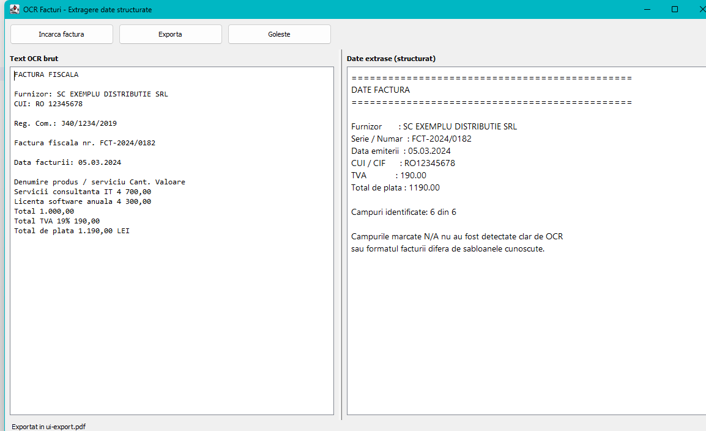

[Home](Home.md) › **Exporting**

# Exporting

Once an invoice has been read, **Exporta** (*Export*) saves the result as a file
in one of seven formats.



---

## How to export

1. Load an invoice as usual. Until one has been read, **Exporta** stays greyed
   out — there is nothing to save yet.
2. Click **Exporta**. A save dialog opens, titled
   **Exporta datele facturii** (*Export invoice data*).
3. Pick a format from the list at the bottom of the dialog. Changing the format
   updates the file extension in the name field for you.
4. Confirm. The status bar reports **Exportat in …** (*Exported to …*) when the
   file is written.

The file name is suggested from the invoice you loaded: reading
`factura-03.png` proposes `factura-03.pdf`. The dialog reopens in the folder you
exported to last.

If the file already exists, you are asked before it is replaced.

---

## The seven formats

| Format | Extension | Contains | Best for |
|---|---|---|---|
| **PDF document** | `.pdf` | Fields, goods table, raw text | Filing, printing, sending to someone |
| **Plain text** | `.txt` | Fields, goods table, raw text | Pasting into an e-mail or a note |
| **Markdown** | `.md` | Fields, goods table, raw text | Notes, wikis, issue trackers |
| **HTML page** | `.html` | Fields, goods table, raw text | Opening in a browser, sharing a link |
| **JSON data** | `.json` | Fields, goods table, how sure each value is | Importing into another program |
| **XML data** | `.xml` | Fields, goods table, how sure each value is | Accounting software, data exchange |
| **CSV spreadsheet** | `.csv` | Fields only, one row per invoice | Excel, LibreOffice, a running ledger |

The split is deliberate:

- **Readable formats** — PDF, TXT, Markdown, HTML — carry the twelve fields
  *and* the raw OCR text, because a person reading the file later may need to
  check what the recognition engine actually saw. Values that were worked out
  rather than read carry the same **(?)** mark you see on screen.
- **Data formats** — JSON, XML — carry the fields, the table and a number saying
  how sure the application is of each value, because a program importing them
  can decide for itself what to accept.
- **CSV is the exception**, deliberately: one header row and one value row, so
  that several exported invoices stack into one spreadsheet. Confidence columns
  or a variable number of table rows would destroy that, so it has neither.

---

## What each format looks like

### PDF

An A4 document: the twelve fields, the goods table, the count of how many fields
were recognised, and the raw OCR text underneath in a fixed-width font. Long
invoices continue onto further pages, each numbered.

The text is real text, not a picture, so it can be searched and copied in any
PDF reader.

> **Romanian letters in PDF.** PDF's built-in fonts cannot show `ă`, `ș` or
> `ț`, so those are written as `a`, `s` and `t` in the PDF **only**. Every other
> format keeps them exactly as recognised. If the diacritics matter to you,
> export HTML or TXT instead.

### CSV

A header row of field names and one row of values:

```
supplier,buyer,invoiceNumber,issueDate,dueDate,fiscalCode,registrationNumber,iban,netAmount,vatAmount,totalAmount,currency
SC EXEMPLU DISTRIBUTIE SRL,,FCT-2024/0182,05.03.2024,,RO12345674,,,1000.00,190.00,1190.00,RON
```

Because the header is always the same, several exported invoices stack into one
spreadsheet: paste each new row under the last. A field that was not found is
an empty cell.

Version 1.2 added six columns — buyer, due date, register number, IBAN, net
amount and currency — and changed nothing else about this format. A sheet built
from 1.1 exports needs the six new headers adding; the six original columns are
in the same order and mean the same thing.

### JSON

```json
{
  "fields": {
    "supplier": "SC EXEMPLU DISTRIBUTIE SRL",
    "invoiceNumber": "FCT-2024/0182",
    "issueDate": "05.03.2024",
    "fiscalCode": "RO12345674",
    "netAmount": "1000.00",
    "vatAmount": "190.00",
    "totalAmount": "1190.00",
    "iban": null
  },
  "confidence": {
    "supplier": 0.90,
    "vatAmount": 0.70
  },
  "lineItems": [
    {
      "description": "Ciment Portland",
      "quantity": "10",
      "unitPrice": "32.00",
      "value": "320.00"
    }
  ],
  "summary": {
    "recognized": 10,
    "fields": 12,
    "averageConfidence": 0.87,
    "needsReview": ["vatAmount"]
  }
}
```

A field that was not found is `null`, never a missing key, so the shape of
`fields` is the same every time.

`confidence` gives each value a number between 0 and 1 saying how sure the
application is of it: `1.00` means it was verified — a checksum that adds up, or
an amount confirmed by the other two — and anything under `0.60` also appears in
`needsReview`. See [How It Reads](How-It-Reads.md).

> **This shape changed in 1.2.** Version 1.1 put the field keys at the top level
> of the document. If you have a program reading these files, point it at
> `fields` instead of the root object; nothing inside `fields` changed.

### XML

```xml
<?xml version="1.0" encoding="UTF-8"?>
<invoice recognized="10" fields="12" averageConfidence="0.87">
  <field key="supplier" found="true" confidence="1.00"
         strategy="labelled+checked" review="false">SC EXEMPLU DISTRIBUTIE SRL</field>
  <field key="totalAmount" found="true" confidence="1.00"
         strategy="arithmetic-confirmed" review="false">1190.00</field>
  <field key="iban" found="false"></field>
  <lineItems count="1">
    <item quantity="10" unitPrice="32.00" value="320.00">Ciment Portland</item>
  </lineItems>
</invoice>
```

The `found` attribute distinguishes "not printed on the invoice" from "read as
an empty value". `confidence` and `review` say how much to trust the value, and
`strategy` says how it was arrived at.

Everything 1.2 added here is an extra attribute or an extra element, so a program
written against the 1.1 format keeps working unchanged.

### Markdown and HTML

Both render the fields as a table, the goods table beneath it, and the raw OCR
text below that. Values that were worked out carry the **(?)** mark, with a note
explaining it. The HTML file is self-contained — the styling is inside the file —
so it can be e-mailed or archived on its own and still look right; hovering over
a value shows how it was found.

---

## Field names in data formats

JSON, XML and CSV use fixed English keys, never the translated labels, so a file
means the same thing whatever language the interface is set to:

| Interface label | Key in JSON, XML and CSV |
|---|---|
| Furnizor | `supplier` |
| Cumparator | `buyer` |
| Serie / Numar | `invoiceNumber` |
| Data emiterii | `issueDate` |
| Data scadentei | `dueDate` |
| CUI / CIF | `fiscalCode` |
| Reg. Comertului | `registrationNumber` |
| Cont bancar (IBAN) | `iban` |
| Total fara TVA | `netAmount` |
| TVA | `vatAmount` |
| Total de plata | `totalAmount` |
| Moneda | `currency` |

The rows of the goods table use `description`, `quantity`, `unitPrice` and
`value` in JSON, and the same names as attributes in XML.

---

## Choosing which format opens first

The save dialog starts on PDF. To change that, set
[`export.defaultFormat`](Settings.md#default-export-format) to `pdf`, `txt`,
`md`, `html`, `json`, `xml` or `csv`.

---

## Notes

- Exporting never changes the invoice image, and never alters what is on screen.
- Values are exported exactly as shown in the right-hand panel, already
  [normalised](Extracted-Fields.md#how-values-are-cleaned-up) — amounts as
  `1190.00`, dates as `05.03.2024`.
- Fields shown as `N/A` are exported as empty (CSV, XML), `null` (JSON) or
  `N/A` (readable formats).
- Table columns the invoice did not print behave the same way, so an absent
  quantity is `null` rather than `0`.
- If writing fails — a full disk, a read-only folder, a disconnected network
  drive — an existing file of the same name is left untouched. See
  [Troubleshooting](Troubleshooting.md#could-not-write-the-file).

---

**See also:** [The Main Window](The-Main-Window.md) ·
[Extracted Fields](Extracted-Fields.md) · [Settings](Settings.md)
