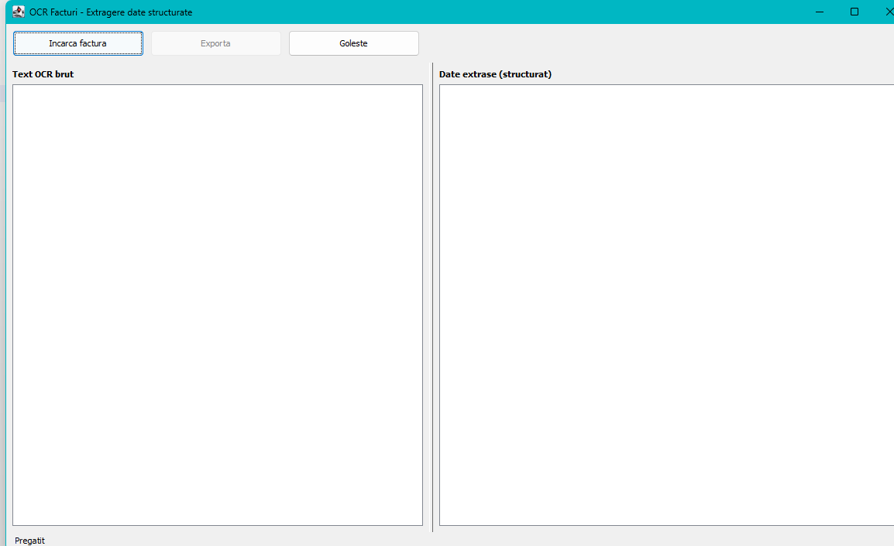

[Home](Home.md) › **Getting Started**

# Getting Started

This page walks through one invoice from start to finish. It assumes the
application is [installed](Installation.md) and starts up.

---

## Step 1 — Start the application

Double-click `invoice-ocr.jar`, or run `java -jar invoice-ocr.jar`.



Both panels are empty and the status bar at the bottom left reads **Pregatit**
(*Ready*). The application is waiting for you.

---

## Step 2 — Load an invoice

Click **Incarca factura** (*Load invoice*).

A file dialog opens, titled **Selecteaza factura** (*Select invoice*). It only
lists picture files — PNG, JPG, JPEG, BMP, TIF, TIFF and GIF — because those are
the formats the application can read. If your invoice is a PDF, see
[Preparing Invoices](Preparing-Invoices.md#pdf-invoices).

Select your file and confirm.

> The dialog reopens in the last folder you used, so processing a series of
> invoices from the same folder takes two clicks each.

---

## Step 3 — Wait for recognition

While the invoice is being read:

- a progress bar runs next to the buttons,
- both buttons are greyed out,
- the mouse pointer becomes an hourglass,
- the status bar shows **Se proceseaza …** (*Processing …*) with the file name.

A typical page takes **one to three seconds**. The window stays responsive — you
can move or resize it while it works.

---

## Step 4 — Read the result


The window fills in two panels:

**Left — Text OCR brut** (*Raw OCR text*)
Exactly what the recognition engine read, line by line, in a fixed-width font.
This panel is your evidence. If a field came out wrong, look here first: you will
usually see that the engine misread a character, rather than the application
mis-assigning a value.

**Right — Date extrase (structurat)** (*Extracted data, structured*)
The twelve fields, cleaned up and normalised, with the goods table beneath them:

```
==============================================
DATE FACTURA
==============================================

Furnizor            : SC EXEMPLU DISTRIBUTIE SRL
Cumparator          : N/A
Serie / Numar       : FCT-2024/0182
Data emiterii       : 05.03.2024
Data scadentei      : N/A
CUI / CIF           : RO12345674
Reg. Comertului     : N/A
Cont bancar (IBAN)  : N/A
Total fara TVA      : 1000.00
TVA                 : 190.00
Total de plata      : 1190.00
Moneda              : RON (?)

----------------------------------------------
Articole
----------------------------------------------
Denumire                  Cant  Pret unitar     Valoare
Servicii consultanta IT      1      700.00      700.00
Licenta software anuala      1      300.00      300.00

Campuri identificate: 8 din 12
```

The status bar confirms the same thing: `factura-exemplu.png: 8 campuri
identificate, 1 de verificat` (*8 fields identified, 1 to check*).

Notice the **(?)** beside the currency. It marks a value the application worked
out rather than read from its own label — see
[How It Reads](How-It-Reads.md). Everything without a mark was read directly, or
checked arithmetically.

What each field means, and which invoice labels the application looks for, is
explained in [Extracted Fields](Extracted-Fields.md).

---

## Step 5 — Use the result

**Export it.** Click **Exporta** (*Export*) and choose a format — PDF, TXT,
Markdown, HTML, JSON, XML or CSV. The file name is suggested from the invoice
you loaded. [Exporting](Exporting.md) explains which format suits which job.

**Or copy it.** The panels are read-only, but the text is selectable:

| Action | Keys |
|---|---|
| Select everything in a panel | Click in it, then `Ctrl+A` |
| Copy the selection | `Ctrl+C` |

Paste into your accounting software, a spreadsheet or an e-mail. Drag the
divider between the panels to give one side more room, or maximise the window
for long invoices.

---

## Step 6 — Next invoice

Just click **Incarca factura** again; the new result replaces the old one. Use
**Goleste** (*Clear*) if you want to empty both panels first — useful when you
step away and do not want to mistake an old result for a new one.

---

## When fields show N/A

`N/A` means the application did not find that field, and it refuses to guess.
The footer tells you how many of the twelve were found, for example
`Campuri identificate: 8 din 12`. A blank field is not always a failure: most
invoices genuinely do not print a bank account or a due date.

The three usual causes, in order of likelihood:

1. **The scan is hard to read** — the most common by far.
   → [Preparing Invoices](Preparing-Invoices.md)
2. **The wrong recognition language is configured**, so Romanian words come out
   garbled. → [Settings](Settings.md#recognition-language)
3. **The invoice uses an unusual label** the application does not know.
   → [Extracted Fields](Extracted-Fields.md#which-labels-are-recognised)

---

**Next:** [The Main Window](The-Main-Window.md) ·
[Extracted Fields](Extracted-Fields.md)
